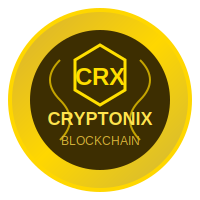

# cryptonix
Cryptonix Digital

  

<h1 align="center">CRYPTONIX</h1>

<strong>Cryptonix is a secure and user-friendly digital wallet platform</strong>

---

Cryptonix offers fast and secure transactions, user profile management, 
QR code generation, and much more — all in a fully mobile-friendly interface.

---

## 🔥 Features

- 🔐 User Registration & Login System  
- ✅ Email Verification  
- 🔑 6-Digit MPIN Security  
- 💸 Send & Receive Money via Mobile Number or Wallet ID  
- 📄 Transaction History with Filters  
- ⚙️ User Profile Management  
- 🔍 User Search  
- 🧾 Recent Transfers & Dashboard Overview  
- 📱 Fully Responsive & Mobile-Optimized Design  

---

## 🔗 Live Demo

<a href="https://cryptonixdigital.github.io/cryptonix/" target="_blank">
🔗 View Dashboard Demo
</a>

---

## 🌐 Social Media

[YouTube](https://youtube.com/@cryptonixwallet) •  
[Telegram](https://t.me/cryptonixwallet) •  
[Instagram](https://instagram.com/cryptonixwallet) •  
[Website](https://cryptonix.web.app)

---

## 🛡️ Security Guidelines

Cryptonix uses professionally configured Firebase Realtime Database rules:

- Only authenticated users can read/write data  
- Users can access and modify only their own data  
- Transactions can be written only once per request  
- The recipient must exist before processing  
- Timestamps must not be set in the future  
- Sender and recipient must not be the same user  

---

## ⚙️ Technologies Used

HTML • CSS • JavaScript  
Firebase Authentication  
Firebase Realtime Database  
QR Code Generator  

---

## 👨‍💻 Developer

<strong>Polash Mondal</strong> 

---

For any queries, suggestions, or support — feel free to connect.  
Cryptonix welcomes you to the next generation of digital wallet experiences!

